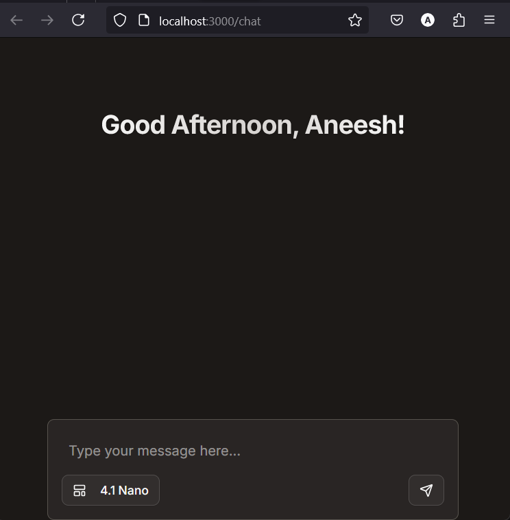
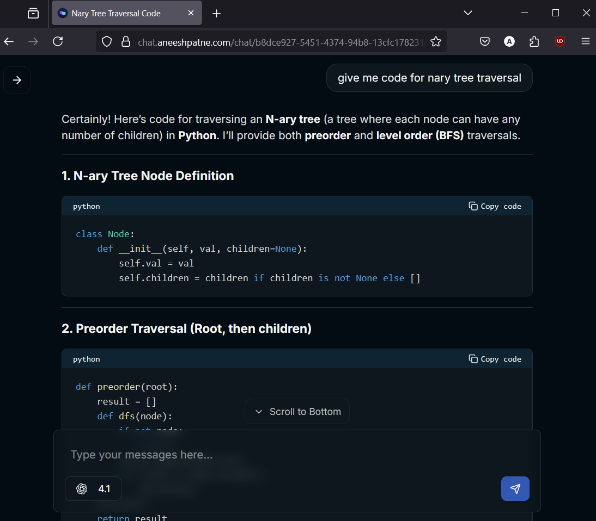

# 🤖 Unified AI Chat Platform

> _Access the world's most advanced AI models in one seamless interface_

A sophisticated conversational AI platform built with Next.js that provides unified access to multiple cutting-edge AI models from leading providers including OpenAI, Google, Anthropic, X.AI, and more.

[](https://nextjs.org/)
[](https://www.typescriptlang.org/)
[](https://tailwindcss.com/)
[](https://supabase.com/)

## 📸 Screenshots

<div align="center">

|                        Chat Interface                        |                        Conversation                        |
| :----------------------------------------------------------: | :----------------------------------------------------------: |
|  |  |

</div>

## ✨ Features

### 🧠 **Comprehensive AI Model Support**

- **OpenAI**: GPT-4.1 family, GPT-4o series, O-series reasoning models
- **Google**: Gemini 2.5 Pro, Gemini 2.0 Flash models
- **Anthropic**: Claude 4 Sonnet, Claude 3.7, Claude 3.5
- **X.AI**: Grok 3, Grok 3 Mini
- **DeepSeek**: DeepSeek V3, DeepSeek R1 Distil
- **Perplexity**: Sonar Reasoning Pro, Sonar Deep Research
- **Meta**: Llama 3.1, Llama 4 Scout
- **Qwen**: Qwen 3 Mini

### 🔐 **Authentication & Security**

- **Multi-provider Authentication**: Supabase Auth + Firebase Google OAuth
- **Session Management**: Persistent sessions with secure token handling
- **Protected Routes**: Middleware-based route protection

### 💬 **Advanced Chat Features**

- **Real-time Streaming**: Live response streaming with WebSocket support
- **Session Persistence**: Unique URLs for each chat session
- **Auto-generated Titles**: AI-powered conversation naming
- **Token Usage Tracking**: Detailed usage analytics per conversation
- **Reasoning Display**: View AI thought processes for compatible models
- **Message Management**: Save, retrieve, and manage conversation history

### 🎨 **Modern User Experience**

- **Dark Mode Interface**: Sleek, modern dark theme
- **Responsive Design**: Mobile-first, responsive across all devices
- **Model Switching**: Instant switching between AI models
- **Rich Text Support**: Full markdown rendering with syntax highlighting
- **Code Block Features**: Copy-to-clipboard, language detection
- **Loading States**: Beautiful loading animations and states

### 🔧 **Developer Experience**

- **TypeScript**: Full type safety throughout the application
- **Component Architecture**: Modular, reusable React components
- **Database Integration**: Drizzle ORM with PostgreSQL
- **API Route Handlers**: Robust error handling and validation
- **Middleware**: Custom authentication and session middleware

## 🚀 Quick Start

### Prerequisites

- **Node.js** 18.0 or higher
- **npm** or **yarn** or **pnpm**
- **Database**: PostgreSQL instance (or Supabase)

### 1. Clone & Install

```bash
git clone https://github.com/yourusername/unified-ai-chat.git
cd unified-ai-chat/chat
npm install
```

### 2. Environment Setup

Create a `.env.local` file in the `chat` directory:

```env
# AI Provider API Keys
OPENAI_API_KEY=your_openai_api_key
OPENROUTER_API_KEY=your_openrouter_api_key
GOOGLE_API_KEY=your_google_api_key

# Supabase Configuration
NEXT_PUBLIC_SUPABASE_URL=your_supabase_url
NEXT_PUBLIC_SUPABASE_ANON_KEY=your_supabase_anon_key

# Database
DATABASE_URL=your_postgresql_connection_string

# Firebase (for Google OAuth)
FIREBASE_PROJECT_ID=your_firebase_project_id
FIREBASE_CLIENT_EMAIL=your_firebase_client_email
FIREBASE_PRIVATE_KEY=your_firebase_private_key
```

### 3. Database Setup

Run database migrations:

```bash
npm run db:migrate
# or if using Drizzle directly
npx drizzle-kit migrate
```

### 4. Development Server

```bash
npm run dev
# Server runs on http://localhost:3000
```

## 🏗️ Architecture

### Project Structure

```
chat/
├── app/                        # Next.js 15 App Router
│   ├── (auth)/                # Authentication routes
│   │   └── auth/              # Login page & callbacks
│   ├── (chat)/                # Protected chat routes
│   │   └── chat/              # Main chat interface
│   ├── actions/               # Server actions
│   ├── api/                   # API route handlers
│   │   ├── (chat)/           # Chat-specific APIs
│   │   └── test/             # Testing endpoints
│   ├── globals.css           # Global styles
│   ├── layout.tsx            # Root layout
│   └── middleware.ts         # Authentication middleware
├── components/                # React components
│   ├── ui/                   # Reusable UI components
│   ├── chat.jsx              # Main chat component
│   ├── models.tsx            # AI model configurations
│   ├── navbar.tsx            # Navigation component
│   └── firebaseAuth.tsx      # Firebase authentication
├── lib/                      # Utilities & configurations
│   ├── shema/               # Database schemas
│   ├── db.ts                # Database connection
│   ├── firebaseConfig.js    # Firebase setup
│   └── utils.ts             # Utility functions
├── utlis/supabase/          # Supabase utilities
│   ├── client.ts            # Client-side Supabase
│   ├── server.ts            # Server-side Supabase
│   └── middleware.ts        # Supabase middleware
└── public/                  # Static assets
    └── [provider-logos]     # AI provider logos
```

### Technology Stack

| Category           | Technology                                                                                   | Purpose                                    |
| ------------------ | -------------------------------------------------------------------------------------------- | ------------------------------------------ |
| **Framework**      | [Next.js 15](https://nextjs.org/)                                                            | React framework with App Router            |
| **Language**       | [TypeScript](https://www.typescriptlang.org/)                                                | Type-safe development                      |
| **Styling**        | [Tailwind CSS 4](https://tailwindcss.com/)                                                   | Utility-first CSS framework                |
| **Database**       | [PostgreSQL](https://www.postgresql.org/) + [Drizzle ORM](https://orm.drizzle.team/)         | Data persistence and ORM                   |
| **Authentication** | [Supabase Auth](https://supabase.com/auth) + [Firebase](https://firebase.google.com/)        | Multi-provider authentication              |
| **AI Integration** | [Vercel AI SDK](https://sdk.vercel.ai/)                                                      | AI model integration and streaming         |
| **UI Components**  | [Radix UI](https://www.radix-ui.com/) + [Lucide React](https://lucide.dev/)                  | Accessible components and icons            |
| **Animation**      | [Framer Motion](https://www.framer.com/motion/)                                              | Smooth animations and transitions          |
| **Markdown**       | [React Markdown](https://github.com/remarkjs/react-markdown) + [Shiki](https://shiki.style/) | Markdown rendering and syntax highlighting |

## 🔧 Configuration

### AI Model Configuration

Models are configured in `components/models.tsx`. Each model includes:

```typescript
type Model = {
  name: string; // Display name
  id: string; // API model identifier
  provider: string; // Provider type (openai, openrouter, etc.)
  img: string; // Logo path
};
```

### Environment Variables Reference

| Variable                        | Required | Description                                  |
| ------------------------------- | -------- | -------------------------------------------- |
| `OPENAI_API_KEY`                | Yes      | OpenAI API key for GPT models                |
| `OPENROUTER_API_KEY`            | Yes      | OpenRouter API key for multi-provider access |
| `GOOGLE_API_KEY`                | Optional | Direct Google AI API access                  |
| `NEXT_PUBLIC_SUPABASE_URL`      | Yes      | Supabase project URL                         |
| `NEXT_PUBLIC_SUPABASE_ANON_KEY` | Yes      | Supabase anonymous key                       |
| `DATABASE_URL`                  | Yes      | PostgreSQL connection string                 |
| `FIREBASE_PROJECT_ID`           | Yes      | Firebase project ID                          |
| `FIREBASE_CLIENT_EMAIL`         | Yes      | Firebase service account email               |
| `FIREBASE_PRIVATE_KEY`          | Yes      | Firebase service account private key         |

## 🚀 Deployment

### Vercel Deployment (Recommended)

1. **Connect Repository**: Link your GitHub repository to Vercel
2. **Environment Variables**: Add all required environment variables in Vercel dashboard
3. **Database**: Set up PostgreSQL (Vercel Postgres, Supabase, or Neon)
4. **Deploy**: Automatic deployment on every push to main branch

### Manual Deployment

```bash
# Build the application
npm run build

# Start production server
npm start
```

## 🔑 API Reference

### Chat API

**POST** `/api/chat`

Stream AI responses with real-time token usage tracking.

```typescript
// Request
{
  messages: Array<{id: string, role: string, content: string}>,
  data: {
    model: string,
    provider: string,
    sessionId: string
  }
}

// Response: Streaming text with token usage
```

### Message Management

**POST** `/api/savemessage`

Save conversation messages to database.

```typescript
// Request
{
  id: string,
  chatId: string,
  role: 'user' | 'assistant',
  content: string,
  reasoning?: string,
  promptTokens?: number,
  completionTokens?: number,
  totalTokens?: number
}
```

## 🤝 Contributing

We welcome contributions! Here's how to get started:

### Development Setup

1. **Fork the repository**
2. **Create a feature branch**: `git checkout -b feature/amazing-feature`
3. **Install dependencies**: `npm install`
4. **Set up environment**: Copy `.env.example` to `.env.local`
5. **Run development server**: `npm run dev`

### Contribution Guidelines

- **Code Style**: Follow the existing TypeScript and React patterns
- **Testing**: Ensure your changes don't break existing functionality
- **Documentation**: Update README if you add new features
- **Commit Messages**: Use conventional commit format

### Areas for Contribution

- 🧠 **New AI Models**: Add support for additional AI providers
- 🎨 **UI/UX**: Improve the user interface and experience
- 🔧 **Features**: Implement new chat features or capabilities
- 📚 **Documentation**: Improve documentation and examples
- 🐛 **Bug Fixes**: Fix issues and improve stability

---

<div align="center">

**[🌟 Star this repository](https://github.com/yourusername/unified-ai-chat)** if you find it helpful!

Made with ❤️ for the AI community

</div>
